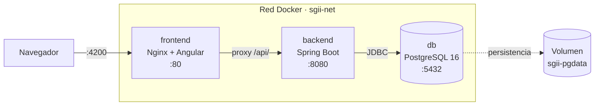
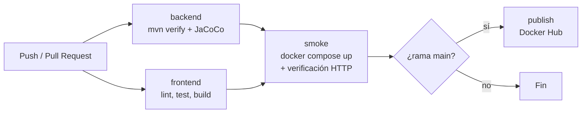

# Sistema de Gestión Institucional de Indicadores (SGII)

[](https://github.com/jhosuechica/sgii-indicadores/actions/workflows/ci.yml)
[](https://openjdk.org/projects/jdk/21/)
[](https://spring.io/projects/spring-boot)
[](https://angular.dev/)
[](https://www.postgresql.org/)
[](https://docs.docker.com/compose/)

Plataforma web para el registro, seguimiento y visualización de los indicadores
de gestión de una institución educativa. Permite definir indicadores con sus
metas, registrar mediciones periódicas y consultar el avance mediante reportes.

> **Estado del proyecto:** este repositorio incluye la aplicación completa más
> la infraestructura de calidad y despliegue: pruebas automatizadas,
> contenedorización y pipeline de integración continua.

---

## Tabla de contenido

- [Capturas](#capturas)
- [Arquitectura](#arquitectura)
- [Stack técnico](#stack-técnico)
- [Ejecución rápida con Docker](#ejecución-rápida-con-docker)
- [Desarrollo local sin Docker](#desarrollo-local-sin-docker)
- [Pruebas y cobertura](#pruebas-y-cobertura)
- [Pipeline de CI/CD](#pipeline-de-cicd)
- [Estructura del repositorio](#estructura-del-repositorio)
- [Decisiones técnicas](#decisiones-técnicas)
- [Resultados medibles](#resultados-medibles)
- [Autor](#autor)

---

## Capturas

| Panel de indicadores | Registro de mediciones |
|---|---|
|  |  |

---

## Arquitectura

Tres contenedores en una red interna de Docker. Solo el frontend y la API
publican puertos al host; la base de datos permanece aislada.



**Por qué Nginx hace de proxy hacia `/api/`:** el navegador ve un solo origen,
así que no hay CORS que configurar ni URLs del backend quemadas por ambiente en
el código Angular. Cambiar de entorno es cambiar el `docker-compose.yml`, no
recompilar el frontend.

**Orden de arranque:** `frontend` espera a que `backend` esté *healthy*, y
`backend` espera a que `db` esté *healthy*. Se usa `condition: service_healthy`
y no el simple `depends_on`, porque que el contenedor haya arrancado no
significa que el servicio ya acepte conexiones.

---

## Stack técnico

| Capa | Tecnología |
|---|---|
| Frontend | Angular 17, TypeScript, Nginx 1.27 (Alpine) |
| Backend | Java 21, Spring Boot 3.x, Spring Data JPA |
| Base de datos | PostgreSQL 16 (Alpine) |
| Pruebas | JUnit 5, Mockito, AssertJ, Testcontainers, JaCoCo |
| Contenedores | Docker, Docker Compose, builds multi-etapa |
| CI/CD | GitHub Actions, Docker Hub |

---

## Ejecución rápida con Docker

**Requisitos:** Docker Desktop (o Docker Engine + Compose v2). Nada más: no
necesitas Java, Node ni PostgreSQL instalados.

```bash
git clone https://github.com/jhosuechica/sgii-indicadores.git
```

```bash
cd sgii-indicadores && cp .env.example .env
```

Edita `.env` y define al menos `POSTGRES_PASSWORD` y `JWT_SECRET`. Luego:

```bash
docker compose up -d --build
```

Cuando los tres contenedores estén sanos:

| Servicio | URL |
|---|---|
| Aplicación | http://localhost:4200 |
| API | http://localhost:8080/api |
| Health check | http://localhost:8080/actuator/health |

Comandos útiles:

```bash
docker compose ps
```

```bash
docker compose logs -f backend
```

```bash
docker compose down
```

```bash
docker compose down -v
```

El último elimina también el volumen: la base de datos se borra por completo.

---

## Desarrollo local sin Docker

Si prefieres correr backend y frontend desde el IDE, levanta solo la base de
datos en un contenedor:

```bash
docker compose up -d db
```

Descomenta el bloque `ports` del servicio `db` en `docker-compose.yml` para
exponer el `5432` al host, y luego:

```bash
cd backend && ./mvnw spring-boot:run
```

```bash
cd frontend && npm install && npm start
```

---

## Pruebas y cobertura

Dos niveles, deliberadamente separados:

| Tipo | Sufijo | Plugin | Necesita Docker | Qué verifica |
|---|---|---|---|---|
| Unitarias | `*Test.java` | Surefire | No | Lógica de negocio con dependencias simuladas (Mockito) |
| Integración | `*IT.java` | Failsafe | Sí | Consultas SQL reales contra PostgreSQL vía Testcontainers |

```bash
cd backend && ./mvnw test
```

Solo unitarias. Segundos, sin Docker: el ciclo que usas mientras programas.

```bash
cd backend && ./mvnw verify
```

Todo, más el reporte de cobertura y la verificación del umbral. Es exactamente
lo que ejecuta el pipeline.

Reporte HTML: `backend/target/site/jacoco/index.html`

**Umbral de cobertura:** el build **falla** si la cobertura de líneas baja del
**60 %**. Sin esa regla, un reporte de cobertura es decorativo. Se excluyen del
cálculo DTOs, entidades y clases de configuración: medirlos infla el porcentaje
sin decir nada sobre la calidad real de las pruebas.

---

## Pipeline de CI/CD

Definido en [`.github/workflows/ci.yml`](.github/workflows/ci.yml).



| Job | Cuándo corre | Qué hace |
|---|---|---|
| `backend` | Siempre | Compila, ejecuta unitarias e integración, verifica el umbral de cobertura, publica el reporte como artefacto |
| `frontend` | Siempre | `npm ci`, lint, tests, build de producción |
| `smoke` | Tras los anteriores | Levanta el stack completo con Compose y comprueba que la API y el frontend responden de verdad |
| `publish` | Solo en `main` | Construye y sube ambas imágenes a Docker Hub con las etiquetas `latest` y el SHA del commit |

Detalles que vale la pena señalar:

- El job `smoke` es la diferencia entre comprobar que las imágenes compilan y
  comprobar que el sistema arranca. Muchos pipelines solo hacen lo primero.
- Cada imagen se etiqueta con el **SHA del commit** además de `latest`, para
  poder volver a una versión exacta sin depender de un tag mutable.
- `concurrency` cancela pipelines obsoletos: si llegan dos commits seguidos a la
  misma rama, solo se ejecuta el último.
- Las credenciales de Docker Hub viven en *Secrets*; nunca en el repositorio.

**Configuración requerida** en *Settings → Secrets and variables → Actions*:

| Nombre | Tipo | Valor |
|---|---|---|
| `DOCKERHUB_USERNAME` | Variable | Tu usuario de Docker Hub |
| `DOCKERHUB_TOKEN` | Secret | Un *Access Token* de Docker Hub (no la contraseña) |

---

## Estructura del repositorio

```
.
├── .github/workflows/ci.yml     Pipeline de CI/CD
├── backend/
│   ├── Dockerfile               Build multi-etapa (Maven -> JRE Alpine)
│   ├── .dockerignore
│   ├── pom.xml
│   └── src/
│       ├── main/java/...
│       └── test/java/...        *Test.java (unitarias) y *IT.java (integración)
├── frontend/
│   ├── Dockerfile               Build multi-etapa (Node -> Nginx)
│   ├── nginx.conf               SPA fallback, proxy /api, caché, compresión
│   ├── .dockerignore
│   └── src/
├── db/init/                     Scripts SQL de inicialización
├── docs/
│   ├── ARQUITECTURA.md
│   ├── adr/                     Registros de decisiones de arquitectura
│   └── img/                     Capturas
├── docker-compose.yml
├── .env.example
├── .gitattributes               Normalización de finales de línea
└── LICENSE                      MIT
```

---

## Decisiones técnicas

Las decisiones no triviales están documentadas como ADR (*Architecture Decision
Record*), cada una con su contexto, alternativas descartadas y consecuencias:

- [ADR-0001 · Builds multi-etapa en lugar de imagen única](docs/adr/0001-builds-multietapa.md)
- [ADR-0002 · PostgreSQL en Compose con volumen nombrado](docs/adr/0002-postgres-en-compose.md)
- [ADR-0003 · GitHub Actions como plataforma de CI](docs/adr/0003-github-actions.md)
- [ADR-0004 · Testcontainers en lugar de H2](docs/adr/0004-testcontainers-sobre-h2.md)

Ver también [docs/ARQUITECTURA.md](docs/ARQUITECTURA.md).

---

## Resultados medibles

Comparación entre el flujo manual anterior y el actual con contenedores.
Todas las cifras se midieron en el mismo equipo, promediando tres ejecuciones.

| Métrica | Antes | Después | Mejora |
|---|---|---|---|
| Puesta en marcha desde cero (máquina nueva) | — | — | — |
| Tamaño de la imagen del backend | — | — | — |
| Pasos manuales para desplegar | — | — | — |
| Cobertura de pruebas (líneas) | 0 % | — | — |

---

## Autor

**Jhosué Chica** — Desarrollador de Software
[LinkedIn](https://www.linkedin.com/in/jhosue-chica-0811a933a) · [GitHub](https://github.com/jhosuechica)
