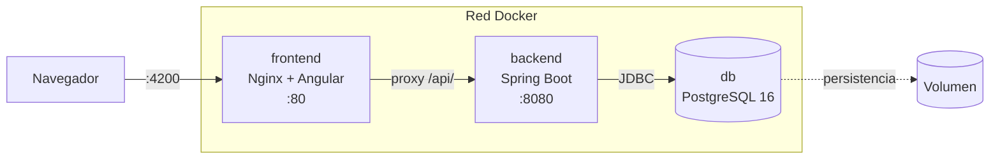

# Plantilla de contenerización y CI/CD para Spring Boot + Angular

[](https://github.com/jhosuechica/plantilla-spring-angular-docker/actions/workflows/ci.yml)
[](https://openjdk.org/projects/jdk/21/)
[](https://docs.docker.com/compose/)
[](https://www.postgresql.org/)
[](LICENSE)

Capa de infraestructura lista para añadir a un proyecto Spring Boot + Angular +
PostgreSQL: builds multi-etapa, orquestación con Docker Compose y un pipeline de
integración continua.

> **Qué es y qué no es.** Este repositorio contiene **infraestructura, no una
> aplicación**. No hay `pom.xml`, ni `package.json`, ni código Java o
> TypeScript: se copia sobre un proyecto que ya los tiene. Si buscas un sistema
> ejecutable de principio a fin, no es este repositorio.

El motivo de que exista: la parte de contenerizar y automatizar un proyecto
Spring Boot + Angular es casi idéntica cada vez, y casi siempre se rehace desde
cero. Aquí está resuelta una vez, documentada y con las decisiones justificadas.

---

## Tabla de contenido

- [Qué incluye](#qué-incluye)
- [Qué debe cumplir tu proyecto](#qué-debe-cumplir-tu-proyecto)
- [Cómo usarla](#cómo-usarla)
- [La arquitectura que monta](#la-arquitectura-que-monta)
- [El pipeline](#el-pipeline)
- [Decisiones técnicas](#decisiones-técnicas)
- [Limitaciones conocidas](#limitaciones-conocidas)
- [Autor](#autor)

---

## Qué incluye

| Archivo | Qué resuelve |
|---|---|
| `backend/Dockerfile` | Build multi-etapa Maven → JRE Alpine, usuario sin privilegios, caché de dependencias |
| `frontend/Dockerfile` | Build multi-etapa Node → Nginx, con **detección automática** de la carpeta de salida de Angular |
| `frontend/nginx.conf` | Fallback de rutas de la SPA, proxy `/api` que elimina el CORS, caché diferenciada, cabeceras de seguridad |
| `docker-compose.yml` | Los tres servicios con healthchecks encadenados y el nombre del proyecto parametrizado |
| `.github/workflows/ci.yml` | Pruebas del backend con cobertura, build del frontend, prueba de humo del stack y publicación de imágenes |
| `.env.example` | Todo lo configurable, con `.env` fuera del control de versiones |
| `backend/src/test/resources/` | Perfil de pruebas listo para Testcontainers |
| `db/init/` | Punto de entrada para scripts SQL de arranque |

Tres detalles que suelen costar tiempo y aquí ya están resueltos:

- **La carpeta de salida de Angular no hay que configurarla.** El Dockerfile
  localiza el `index.html` generado, excluyendo el de `server/` que producen los
  proyectos con SSR. Funciona igual en Angular 16 y en 17+.
- **Nginx no se cae si el backend aún no responde.** Con `proxy_pass` hacia una
  variable y el resolver interno de Docker, el nombre se resuelve en cada
  petición y no al cargar la configuración.
- **`depends_on` con `condition: service_healthy`**, porque que un contenedor
  haya arrancado no significa que el servicio acepte conexiones.

---

## Qué debe cumplir tu proyecto

La plantilla asume esta estructura. Si la tuya difiere, hay que ajustar rutas.

| Requisito | Dónde |
|---|---|
| `pom.xml` de Maven | `backend/pom.xml` |
| Código fuente Java | `backend/src/` |
| `package.json` y `package-lock.json` | `frontend/` |
| Script `build` en `package.json` | usado como `npm run build -- --configuration=production` |
| Endpoint `/actuator/health` | necesario para los healthchecks: añade `spring-boot-starter-actuator` |
| Llamadas HTTP a rutas relativas | `/api/...`, no `http://localhost:8080/api/...` |
| Configuración por variables de entorno | `SPRING_DATASOURCE_URL`, `SPRING_DATASOURCE_USERNAME`, `SPRING_DATASOURCE_PASSWORD` |

El requisito del actuator es el que más se olvida: sin él los healthchecks
fallan y el frontend nunca arranca, porque espera a que el backend esté sano.

---

## Cómo usarla

```bash
git clone https://github.com/jhosuechica/plantilla-spring-angular-docker.git plantilla
```

Copia el contenido sobre tu proyecto. El punto es necesario para que se copien
también los archivos ocultos:

```bash
cp -r plantilla/. /ruta/a/tu-proyecto/ && rm -rf /ruta/a/tu-proyecto/.git
```

Luego, en tu proyecto:

```bash
cp .env.example .env
```

Edita `.env`. Lo primero, `PROYECTO`: da nombre a los contenedores, la red, el
volumen y las imágenes. Después las contraseñas y el `JWT_SECRET`.

```bash
docker compose up -d --build
```

| Servicio | URL |
|---|---|
| Aplicación | http://localhost:4200 |
| API | http://localhost:8080/api |
| Health check | http://localhost:8080/actuator/health |

```bash
docker compose ps
```

```bash
docker compose down -v
```

El último borra también el volumen: la base de datos desaparece.

---

## La arquitectura que monta



El navegador ve un solo origen, así que no hay CORS que configurar ni URLs del
backend quemadas por ambiente en el código Angular. Cambiar de entorno es
cambiar variables, no recompilar el frontend.

Detalle en [docs/ARQUITECTURA.md](docs/ARQUITECTURA.md).

---

## El pipeline

Definido en [`.github/workflows/ci.yml`](.github/workflows/ci.yml).

| Job | Cuándo | Qué hace |
|---|---|---|
| `plantilla` | Siempre | Valida la propia plantilla: sintaxis de Compose, lint de los Dockerfiles y `nginx -t` sobre la configuración real |
| `backend` | Si existe `backend/pom.xml` | `mvn verify`: pruebas, cobertura y umbral mínimo |
| `frontend` | Si existe `frontend/package.json` | `npm ci`, lint, tests y build de producción |
| `humo` | Si existen ambos | Levanta el stack completo y comprueba por HTTP que responde |
| `publicar` | Solo en `main` | Sube las imágenes a Docker Hub con etiquetas `latest` y SHA del commit |

Los cuatro últimos se saltan solos cuando no hay aplicación, que es el estado de
este repositorio. El job `plantilla` sí corre siempre: es el que garantiza que
lo que se distribuye aquí está bien formado.

**Configuración para publicar imágenes**, en *Settings → Secrets and variables →
Actions*:

| Nombre | Tipo |
|---|---|
| `DOCKERHUB_USERNAME` | Variable |
| `DOCKERHUB_TOKEN` | Secret (Access Token, no la contraseña) |

---

## Decisiones técnicas

Documentadas como ADR, con su contexto, las alternativas descartadas y las
consecuencias negativas:

- [ADR-0001 · Builds multi-etapa en lugar de imagen única](docs/adr/0001-builds-multietapa.md)
- [ADR-0002 · PostgreSQL en Compose con volumen nombrado](docs/adr/0002-postgres-en-compose.md)
- [ADR-0003 · GitHub Actions como plataforma de CI](docs/adr/0003-github-actions.md)
- [ADR-0004 · Testcontainers en lugar de H2](docs/adr/0004-testcontainers-sobre-h2.md)

El ADR-0004 es una recomendación para el proyecto que use la plantilla, no algo
que esta imponga: aquí solo se deja preparado el perfil de pruebas.

---

## Limitaciones conocidas

- **No contiene una aplicación.** Es el punto de partida de la sección
  anterior, y conviene repetirlo.
- **Una sola instancia por servicio.** Compose orquesta un solo nodo; no hay
  balanceo ni alta disponibilidad.
- **Sin migraciones de esquema.** `db/init/` solo se ejecuta al crear el
  volumen por primera vez. El siguiente paso natural es Flyway o Liquibase.
- **Sin TLS.** Nginx sirve HTTP plano. En producción iría detrás de un proxy
  con certificado.
- **Despliegue no automatizado.** El pipeline publica las imágenes, pero no las
  despliega en ningún servidor.
- **Rutas fijadas.** Asume `backend/` y `frontend/` como directorios. Otra
  estructura obliga a tocar el Compose y los Dockerfiles.

---

## Autor

**Jhosué Chica**, Desarrollador de Software
[LinkedIn](https://www.linkedin.com/in/jhosue-chica-0811a933a) · [GitHub](https://github.com/jhosuechica)
