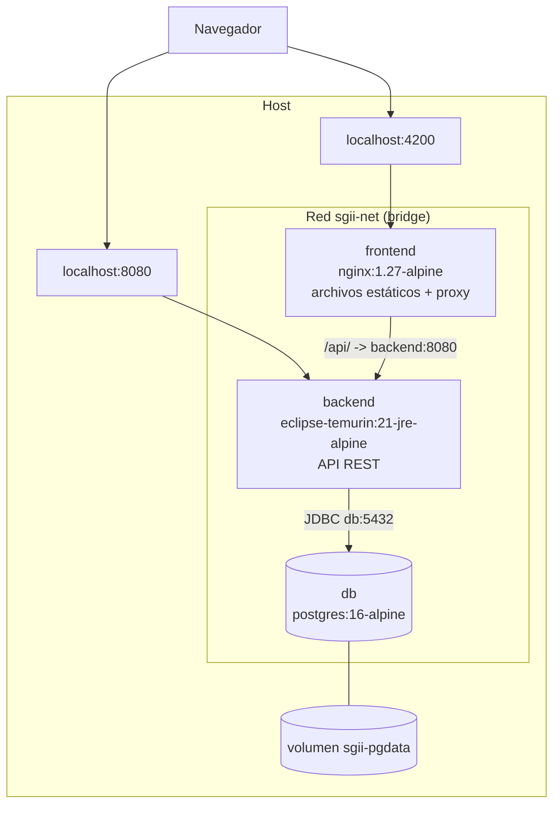
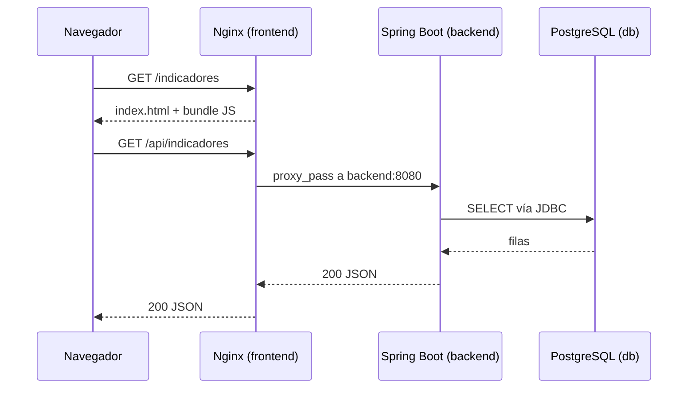
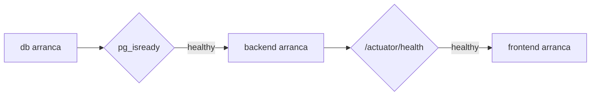

# Arquitectura

## Visión general

El sistema se despliega como tres contenedores en una única red bridge de
Docker (`sgii-net`). La superficie expuesta al host es mínima: solo el frontend
y la API publican puertos; la base de datos únicamente es alcanzable desde
dentro de la red.

## Componentes

### `frontend` — Nginx + Angular compilado

Sirve el bundle estático de Angular y hace de *reverse proxy* de la API.

Responsabilidades:

- Servir `index.html` como fallback de cualquier ruta no existente en disco
  (`try_files $uri $uri/ /index.html`), que es lo que permite recargar una URL
  profunda de la SPA sin recibir un 404.
- Reenviar `/api/` al backend, de modo que el navegador vea un solo origen.
- Comprimir con gzip y aplicar cabeceras de caché diferenciadas: caché de un
  año para los assets con hash en el nombre, `no-store` para `index.html`.

No hay Node en la imagen final: Angular compilado son archivos estáticos.

### `backend` — Spring Boot

API REST y lógica de negocio. Se configura por completo mediante variables de
entorno (`SPRING_DATASOURCE_*`, `JWT_SECRET`, `SPRING_PROFILES_ACTIVE`), sin
credenciales en el `application.yml` versionado.

Expone `/actuator/health`, que cumple dos funciones: el `HEALTHCHECK` de la
imagen y la condición de arranque del frontend en Compose.

Corre como usuario sin privilegios (`spring`), no como root.

### `db` — PostgreSQL

Los datos viven en el volumen nombrado `sgii-pgdata`, separado del ciclo de vida
de los contenedores: `docker compose down` conserva los datos, `down -v` los
elimina.

Los `.sql` que se coloquen en `db/init/` se ejecutan **solo** la primera vez que
se crea el volumen. Sirven para datos semilla, no como sistema de migraciones.

## Flujo de una petición

La segunda petición sale del mismo origen que la página, así que no interviene
CORS en ningún momento.

## Orden de arranque

Compose usa `condition: service_healthy` en lugar de un `depends_on` simple. La
diferencia importa: `depends_on` solo garantiza que el contenedor anterior se
inició, no que el servicio dentro de él acepte conexiones. Con el healthcheck,
el backend no intenta conectarse a una base de datos que todavía está
inicializándose.

## Configuración por entorno

Todo lo que cambia entre entornos son variables, no código ni imágenes:

| Variable | Local | Producción |
|---|---|---|
| `POSTGRES_PASSWORD` | valor de desarrollo en `.env` | gestor de secretos |
| `DDL_AUTO` | `update` | `validate` |
| `SPRING_PROFILES_ACTIVE` | `docker` | `prod` |
| `JWT_SECRET` | valor de desarrollo | gestor de secretos |

La misma imagen que pasó el pipeline es la que se despliega. Esto es lo que
hace reproducible el despliegue: no se recompila nada entre ambientes.

## Seguridad

| Medida | Dónde |
|---|---|
| Contenedor del backend sin root | `Dockerfile` (`USER spring`) |
| Puerto de la base de datos no publicado | `docker-compose.yml` |
| Secretos fuera del repositorio | `.env` en `.gitignore`, `.env.example` versionado |
| Credenciales del pipeline en GitHub Secrets | `ci.yml` |
| Imágenes base Alpine | menos paquetes instalados, menos CVEs |
| Cabeceras `X-Content-Type-Options`, `X-Frame-Options`, `Referrer-Policy` | `nginx.conf` |

## Limitaciones conocidas

- **Una sola instancia por servicio.** No hay balanceo ni alta disponibilidad;
  Compose es un orquestador de un solo nodo. Escalar horizontalmente implica
  Kubernetes o Docker Swarm.
- **Sin migraciones de esquema.** `db/init/` solo actúa en la primera creación
  del volumen. El siguiente paso natural es Flyway o Liquibase.
- **Sin TLS.** Nginx sirve HTTP plano. En un despliegue real iría detrás de un
  proxy con certificado (Traefik, Caddy o un balanceador gestionado).
- **Despliegue no automatizado.** El pipeline publica las imágenes, pero no las
  despliega en el servidor EC2. Falta el paso de *continuous deployment*.

## Evolución posible

1. Migraciones con Flyway y `DDL_AUTO=validate` en todos los entornos.
2. Job de despliegue por SSH a EC2, o `docker context` remoto.
3. Escaneo de vulnerabilidades de imágenes (Trivy) como job del pipeline.
4. Observabilidad: Actuator + Prometheus + Grafana.
5. Migración a Kubernetes si se necesita escalar.
